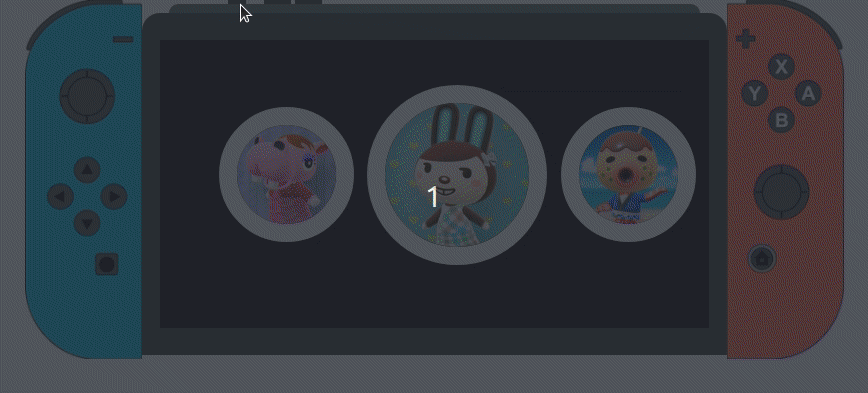

 

  

  <h2 align="center">Mobile Friendly React JS Switch UI Example</h3>

Not a switch emulator but code example for making a single page React application run with Flask. My code and images used are not authorized nor endorsed by Nintendo or in anyway.
 

